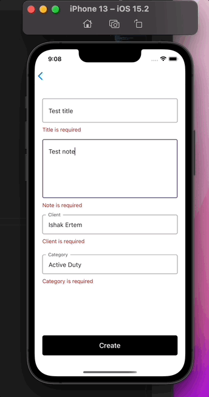

 

## Description

An implementation of Notepad using React-Native

## Technologies and Dependencies used
-React-Native  
-React-Navigation  
-Formik  
-Yup  

## Setting up the development environment

To run this react native app,  

-Clone the project from the github repo  

run

### `yarn` 

Then 

### `yarn ios` or `yarn android`

If you are having trouble installing the app, refer to https://reactnative.dev/docs/environment-setup.

